# LTI — Definición de producto, casos de uso, modelo de datos y arquitectura

## 1. Descripción breve del software

LTI es una plataforma SaaS de recruiting diseñada para optimizar la ejecución real de los procesos de selección en empresas medianas y grandes.
Se centra en eliminar bloqueos operativos, alinear a recruiters y hiring managers desde el inicio y mejorar la calidad de decisión mediante feedback estructurado e inteligencia asistida.
A diferencia de un ATS tradicional, LTI actúa como un sistema operativo del proceso de contratación, no solo como un sistema de registro.

---

## 2. Propuesta de valor

### Qué problema resuelve

Los procesos de selección fallan principalmente por:

* Desalineación inicial entre HR y hiring managers
* Bloqueos operativos como feedback tardío, decisiones pendientes o falta de coordinación
* Evaluaciones inconsistentes y poco estructuradas
* Decisiones finales lentas y con baja trazabilidad

### Para quién

* Equipos de HR y Recruiting en empresas medianas y grandes
* Hiring managers con responsabilidad directa en decisiones de contratación
* Equipos de recruiting operations que necesitan visibilidad y control del proceso

### Por qué es mejor que alternativas

* No se limita a gestionar candidatos: **gestiona la ejecución del proceso**
* Introduce **accountability explícito** en cada fase del flujo
* Mejora la calidad de decisión sin depender de modelos avanzados basados en grandes volúmenes históricos
* Incorpora IA en puntos de alto impacto, con trazabilidad y control humano

---

## 3. Ventajas competitivas

* Visibilidad operativa en tiempo real de bloqueos y responsabilidades por vacante
* Alineación estructurada HR–manager antes de iniciar el proceso
* Feedback comparativo basado en evidencia, no solo en percepción individual
* Coordinación integrada en el flujo de trabajo, reduciendo dependencia de herramientas externas
* Debrief asistido por IA con trazabilidad completa y validación humana
* Enfoque en ejecución y decisión, no solo en gestión de candidatos

---

## 4. Funciones principales

### 4.1 Centro de decisiones y bloqueos del proceso

**Descripción**
Vista centralizada que identifica en tiempo real el estado de cada vacante, los puntos de bloqueo y las responsabilidades asociadas.

**Problema que resuelve**
Falta de visibilidad sobre por qué los procesos no avanzan.

**Cómo aporta valor diferencial**

* Expone explícitamente qué impide avanzar cada proceso
* Prioriza acciones en lugar de mostrar solo estados
* Introduce accountability operativa en recruiters y managers

**Uso de IA**

* Clasificación automática de bloqueos según criticidad
* Sugerencias de acción basadas en señales operativas del proceso

---

### 4.2 Orquestador de alineación de vacante

**Descripción**
Flujo estructurado que define y valida los criterios clave de una vacante antes de iniciar el proceso.

**Problema que resuelve**
Desalineación entre HR y hiring manager en perfil, criterios de evaluación y expectativas.

**Cómo aporta valor diferencial**

* Establece una única fuente de verdad para el inicio del proceso
* Reduce cambios de criterio durante la selección
* Mejora la calidad del filtrado desde el inicio

**Uso de IA**

* Sugerencias de estructuración de perfil basadas en roles similares
* Detección de inconsistencias en criterios definidos

---

### 4.3 Feedback guiado y comparativo en tiempo real

**Descripción**
Sistema de evaluación estructurada que exige evidencias y permite comparar evaluaciones entre entrevistadores.

**Problema que resuelve**
Feedback inconsistente, subjetivo o difícil de comparar.

**Cómo aporta valor diferencial**

* Estandariza la evaluación en base a competencias definidas
* Permite identificar discrepancias entre evaluadores
* Reduce la necesidad de interpretación manual por parte de HR

**Uso de IA**

* Detección de feedback incompleto o poco específico
* Identificación de inconsistencias entre evaluaciones
* Sugerencias para mejorar la calidad del feedback

---

### 4.4 Agenda colaborativa de contratación

**Descripción**
Sistema de coordinación de tareas, responsables y tiempos dentro del proceso de selección.

**Problema que resuelve**
Falta de seguimiento y compromiso por parte de los participantes del proceso.

**Cómo aporta valor diferencial**

* Define ownership explícito de cada tarea
* Permite seguimiento de compromisos en tiempo real
* Reduce dependencia de correos y herramientas externas

**Uso de IA**

* Priorización de tareas según impacto operativo
* Recordatorios inteligentes basados en criticidad y retraso

---

### 4.5 Debrief inteligente y auditable

**Descripción**
Síntesis estructurada del proceso de evaluación de una candidatura, integrando el feedback disponible para facilitar la decisión final.

**Problema que resuelve**
Debriefs manuales lentos, redundantes y con baja consistencia.

**Cómo aporta valor diferencial**

* Consolida la información en una única vista accionable
* Identifica conflictos entre evaluadores
* Facilita decisiones más rápidas y fundamentadas

**Uso de IA**

* Síntesis automática del feedback por competencias
* Identificación de contradicciones y falta de evidencia
* Generación de recomendación de decisión con explicación trazable
* Salida editable y validable por humanos

**Nota de gobernanza**
La decisión final nunca es automática: la IA solo asiste, mientras que la validación y el cierre permanecen bajo control humano.

---

## 5. Lean Canvas

---

# 6. Casos de uso principales

## Caso de uso 1: Alinear una vacante antes de iniciar el proceso

### Nombre

**Alinear vacante entre Recruiter y Hiring Manager**

### Descripción breve

Permite definir y validar de forma estructurada los criterios de una vacante antes de iniciar el proceso de selección, asegurando que recruiter y hiring manager comparten prioridades, requisitos, criterios de evaluación y responsabilidades operativas.

### Actores

* Recruiter
* Hiring Manager

### Disparador

El recruiter necesita abrir una nueva vacante y solicita la validación inicial del hiring manager.

### Precondiciones

* Existe una necesidad de contratación aprobada
* El recruiter tiene permisos para crear la vacante
* El hiring manager responsable está identificado
* La vacante aún no ha comenzado su ejecución operativa

### Flujo principal

1. El recruiter crea una nueva vacante en LTI.
2. El sistema inicia el flujo de alineación.
3. El recruiter define objetivo del rol, requisitos clave y criterios iniciales de evaluación.
4. El sistema envía la propuesta al hiring manager para revisión.
5. El hiring manager revisa y ajusta prioridades, requisitos o expectativas del proceso.
6. El sistema compara ambas definiciones y detecta discrepancias.
7. Recruiter y hiring manager resuelven las discrepancias.
8. El sistema consolida la definición final de la vacante.
9. El hiring manager valida la versión final.
10. El sistema marca la vacante como alineada y lista para ejecución.

### Flujos alternativos

* Si el hiring manager no responde, la vacante permanece pendiente de alineación.
* Si existen discrepancias no resueltas, el sistema no permite cerrar la alineación.
* Si el recruiter modifica criterios críticos después de la validación, el sistema reabre la alineación.

### Resultado final

La vacante queda definida con criterios compartidos, responsables claros y una base operativa común para el resto del proceso.

### Funcionalidades implicadas

* Orquestador de alineación de vacante
* Agenda colaborativa de contratación
* Centro de decisiones y bloqueos del proceso

### Justificación

Es un caso de uso principal porque elimina la desalineación inicial entre HR y negocio, origen frecuente de retrabajo y decisiones inconsistentes.

### Diagrama UML de casos de uso

```plantuml
@startuml
left to right direction

actor Recruiter
actor "Hiring Manager" as HiringManager

rectangle LTI {
  usecase "Alinear vacante" as UC1
  usecase "Definir criterios de vacante" as UC2
  usecase "Validar vacante alineada" as UC3
  usecase "Resolver discrepancias" as UC4
}

Recruiter --> UC1
HiringManager --> UC1

UC1 .> UC2 : <<include>>
UC1 .> UC3 : <<include>>
UC4 .> UC1 : <<extend>>

Recruiter --> UC2
HiringManager --> UC3
Recruiter --> UC4
HiringManager --> UC4

@enduml
````

![Caso de uso 1 - Alinear vacante](assets/CasoUso1_AlinearVacante.png)

---

## Caso de uso 2: Gestionar bloqueos operativos de una vacante activa

### Nombre

**Gestionar bloqueos operativos de una vacante en ejecución**

### Descripción breve

Permite identificar, analizar y resolver cuellos de botella que ralentizan una vacante activa, asignando responsabilidad explícita y facilitando la acción necesaria para reanudar el avance del proceso.

### Actores

* Recruiter
* Hiring Manager
* Entrevistador

### Disparador

Una vacante activa presenta retrasos, tareas pendientes o falta de respuesta de alguno de los participantes del proceso.

### Precondiciones

* La vacante está alineada y en ejecución
* Existen etapas activas con tareas asignadas
* El sistema dispone del estado actualizado del proceso y de sus responsables

### Flujo principal

1. El sistema detecta un bloqueo operativo.
2. El recruiter accede al centro de decisiones y revisa los bloqueos abiertos.
3. El sistema muestra la causa del bloqueo y el responsable actual.
4. El recruiter selecciona el bloqueo prioritario.
5. El sistema presenta el contexto necesario para actuar.
6. El recruiter asigna o activa una acción correctiva.
7. El sistema notifica al responsable correspondiente.
8. El responsable ejecuta la acción pendiente.
9. El sistema valida si el bloqueo ha sido resuelto.
10. El recruiter confirma la recuperación del flujo o mantiene el seguimiento.

### Flujos alternativos

* Si el responsable no actúa, el bloqueo permanece abierto y visible.
* Si el bloqueo afecta a varias personas, el sistema lo descompone en tareas separadas.
* Si la acción ejecutada no resuelve el problema, el bloqueo se reabre.

### Resultado final

La vacante recupera capacidad de avance o queda marcada como bloqueo persistente con responsabilidad visible.

### Funcionalidades implicadas

* Centro de decisiones y bloqueos del proceso
* Agenda colaborativa de contratación
* Feedback guiado y comparativo en tiempo real

### Justificación

Es un caso de uso principal porque representa el núcleo operativo del producto: LTI no solo registra el estado del proceso, sino que ayuda a desbloquearlo activamente.

### Diagrama UML de casos de uso

```plantuml
@startuml
left to right direction

actor Recruiter
actor "Hiring Manager" as HiringManager
actor Entrevistador

rectangle LTI {
  usecase "Gestionar bloqueo operativo" as UC1
  usecase "Analizar bloqueo" as UC2
  usecase "Activar accion correctiva" as UC3
  usecase "Solicitar feedback pendiente" as UC4
  usecase "Solicitar decision pendiente" as UC5
}

Recruiter --> UC1

UC1 .> UC2 : <<include>>
UC1 .> UC3 : <<include>>
UC4 .> UC1 : <<extend>>
UC5 .> UC1 : <<extend>>

Recruiter --> UC2
Recruiter --> UC3
Entrevistador --> UC4
HiringManager --> UC5

@enduml
```

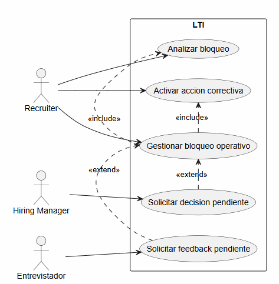

---

## Caso de uso 3: Consolidar evaluación y cerrar decisión de candidatura

### Nombre

**Consolidar evaluación y cerrar decisión final de candidatura**

### Descripción breve

Permite consolidar el feedback de entrevistas, generar un debrief estructurado y facilitar una decisión final trazable entre recruiter y hiring manager.

### Actores

* Recruiter
* Hiring Manager

### Disparador

El candidato ha completado las etapas de evaluación y existe feedback suficiente para preparar la decisión final.

### Precondiciones

* El candidato ha finalizado las entrevistas definidas
* Existe feedback registrado por los evaluadores
* La vacante sigue activa y permite avanzar a decisión final

### Flujo principal

1. El recruiter accede a la candidatura lista para decisión.
2. El sistema valida la completitud del feedback.
3. El sistema genera un debrief estructurado de la candidatura.
4. El sistema identifica inconsistencias o falta de evidencia.
5. El recruiter revisa la síntesis generada.
6. El hiring manager accede al debrief consolidado.
7. Recruiter y hiring manager revisan evidencia y recomendación.
8. El hiring manager toma una decisión final.
9. El recruiter registra la decisión en el sistema.
10. El sistema guarda el cierre con trazabilidad completa.

### Flujos alternativos

* Si falta feedback obligatorio, el sistema no permite cerrar la decisión.
* Si existen contradicciones importantes entre evaluaciones, recruiter y manager revisan manualmente la evidencia antes de decidir.
* Si el hiring manager no valida la decisión, la candidatura permanece en estado pendiente.

### Resultado final

La candidatura queda cerrada con una decisión explícita, fundamentada y auditable.

### Funcionalidades implicadas

* Feedback guiado y comparativo en tiempo real
* Debrief inteligente y auditable
* Centro de decisiones y bloqueos del proceso

### Justificación

Es un caso de uso principal porque conecta evaluación y decisión, el punto donde más valor aporta la combinación de estructura, comparabilidad e inteligencia auditable.

### Diagrama UML de casos de uso

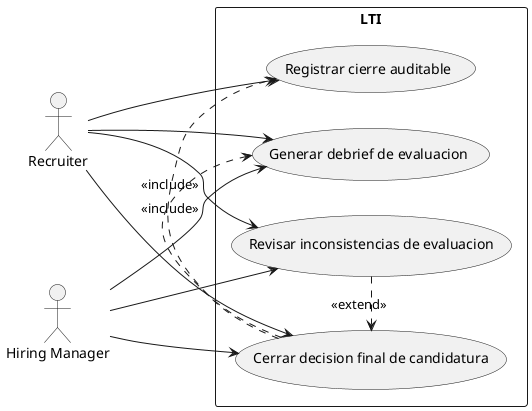

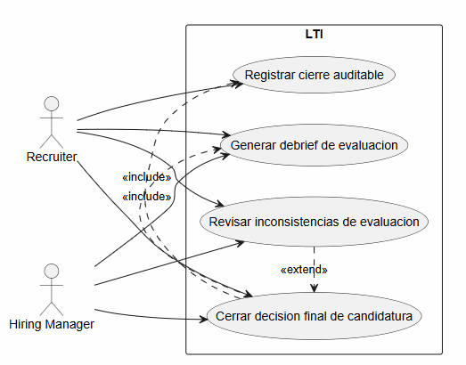

---

# 7. Modelo de datos lógico del MVP de LTI

## 7.1 Entidades principales

### Organization

Representa a la empresa cliente que utiliza LTI para gestionar sus procesos de selección.

**Atributos**

* `id` — UUID — sí — Identificador único de la organización
* `name` — string — sí — Nombre de la organización
* `status` — enum — sí — Estado de la organización dentro del sistema
* `created_at` — datetime — sí — Fecha y hora de alta

---

### User

Representa a un usuario interno de la organización que participa en el proceso de selección.

**Atributos**

* `id` — UUID — sí — Identificador único del usuario
* `organization_id` — UUID — sí — Organización a la que pertenece
* `full_name` — string — sí — Nombre completo
* `email` — string — sí — Correo corporativo
* `role` — enum — sí — Rol principal del usuario en la plataforma
* `status` — enum — sí — Estado del usuario
* `created_at` — datetime — sí — Fecha y hora de creación

**Nota**
`role` representa el rol principal del usuario en la plataforma. La participación efectiva en cada proceso se determina por las relaciones de dominio.

---

### Vacancy

Representa una vacante abierta por la organización y gestionada en LTI.

**Atributos**

* `id` — UUID — sí — Identificador único de la vacante
* `organization_id` — UUID — sí — Organización propietaria
* `title` — string — sí — Nombre del puesto
* `department` — string — sí — Área solicitante
* `location` — string — no — Ubicación asociada
* `employment_type` — enum — sí — Tipo de contratación
* `status` — enum — sí — Estado de la vacante
* `priority` — enum — sí — Prioridad de cobertura
* `created_by_user_id` — UUID — sí — Usuario que crea la vacante
* `created_at` — datetime — sí — Fecha y hora de creación

---

### VacancyAlignment

Representa el acuerdo formal entre recruiter y hiring manager sobre una vacante antes de iniciar su ejecución.

**Atributos**

* `id` — UUID — sí — Identificador único de la alineación
* `vacancy_id` — UUID — sí — Vacante asociada
* `recruiter_user_id` — UUID — sí — Recruiter responsable
* `hiring_manager_user_id` — UUID — sí — Hiring manager responsable
* `role_objective` — text — sí — Objetivo del rol
* `must_have_requirements` — text — sí — Requisitos imprescindibles
* `nice_to_have_requirements` — text — no — Requisitos deseables
* `process_expectations` — text — no — Expectativas del proceso
* `status` — enum — sí — Estado de la alineación
* `validated_at` — datetime — no — Fecha de validación final

**Nota**
En el MVP se modela una única alineación activa por vacante. Si la alineación se reabre, se actualiza la misma entidad.

---

### EvaluationCriterion

Define un criterio de evaluación aplicable a una vacante y utilizado en entrevistas y feedback.

**Atributos**

* `id` — UUID — sí — Identificador único del criterio
* `vacancy_id` — UUID — sí — Vacante a la que pertenece
* `name` — string — sí — Nombre del criterio
* `description` — text — no — Descripción
* `weight` — integer — sí — Peso relativo
* `is_mandatory` — boolean — sí — Indica si es obligatorio
* `created_at` — datetime — sí — Fecha de alta

---

### Candidate

Representa a una persona candidata evaluada en procesos de selección.

**Atributos**

* `id` — UUID — sí — Identificador único
* `full_name` — string — sí — Nombre completo
* `email` — string — sí — Correo principal
* `phone` — string — no — Teléfono
* `current_location` — string — no — Ubicación actual
* `resume_url` — string — no — Referencia al CV
* `created_at` — datetime — sí — Fecha de alta

---

### Application

Representa la candidatura de un candidato a una vacante concreta.

**Atributos**

* `id` — UUID — sí — Identificador único
* `vacancy_id` — UUID — sí — Vacante asociada
* `candidate_id` — UUID — sí — Candidato asociado
* `current_stage` — enum — sí — Etapa actual
* `status` — enum — sí — Estado de la candidatura
* `applied_at` — datetime — sí — Fecha de entrada
* `closed_at` — datetime — no — Fecha de cierre

---

### Interview

Representa una entrevista planificada o ejecutada dentro de una candidatura.

**Atributos**

* `id` — UUID — sí — Identificador único
* `application_id` — UUID — sí — Candidatura asociada
* `interviewer_user_id` — UUID — sí — Entrevistador asignado
* `interview_type` — enum — sí — Tipo de entrevista
* `scheduled_at` — datetime — no — Fecha y hora planificadas
* `completed_at` — datetime — no — Fecha y hora de finalización
* `status` — enum — sí — Estado de la entrevista

---

### Feedback

Representa la evaluación emitida por un entrevistador sobre una entrevista de una candidatura.

**Atributos**

* `id` — UUID — sí — Identificador único
* `application_id` — UUID — sí — Candidatura evaluada
* `interview_id` — UUID — sí — Entrevista asociada
* `author_user_id` — UUID — sí — Usuario que emite el feedback
* `summary` — text — no — Resumen general
* `recommendation` — enum — sí — Recomendación final del evaluador
* `status` — enum — sí — Estado del feedback
* `submitted_at` — datetime — no — Fecha de envío definitivo

---

### FeedbackCriterionAssessment

Descompone un feedback en evaluaciones concretas por criterio.

**Atributos**

* `id` — UUID — sí — Identificador único
* `feedback_id` — UUID — sí — Feedback al que pertenece
* `evaluation_criterion_id` — UUID — sí — Criterio evaluado
* `rating` — integer — sí — Puntuación asignada
* `evidence` — text — no — Evidencia observada

---

### ProcessBlocker

Representa un bloqueo operativo que impide el avance normal de una vacante o candidatura.

**Atributos**

* `id` — UUID — sí — Identificador único
* `vacancy_id` — UUID — sí — Vacante afectada
* `application_id` — UUID — no — Candidatura afectada, si aplica
* `blocker_type` — enum — sí — Tipo de bloqueo
* `description` — text — sí — Descripción del bloqueo
* `status` — enum — sí — Estado del bloqueo
* `responsible_user_id` — UUID — sí — Usuario responsable
* `detected_at` — datetime — sí — Fecha de detección
* `resolved_at` — datetime — no — Fecha de resolución

---

### ActionItem

Representa una acción asignada para resolver un bloqueo o avanzar una tarea del proceso.

**Atributos**

* `id` — UUID — sí — Identificador único
* `process_blocker_id` — UUID — sí — Bloqueo asociado
* `assigned_user_id` — UUID — sí — Usuario responsable
* `title` — string — sí — Título corto
* `description` — text — no — Detalle de la acción
* `due_at` — datetime — no — Fecha objetivo
* `status` — enum — sí — Estado de la acción
* `created_at` — datetime — sí — Fecha de creación
* `completed_at` — datetime — no — Fecha de finalización

**Nota**
La agenda colaborativa del MVP se materializa mediante `ActionItem`, `ProcessBlocker` y responsables asignados; no se modela como entidad independiente.

---

### Debrief

Representa la consolidación final de evaluación de una candidatura, incluyendo síntesis y decisión auditable.

**Atributos**

* `id` — UUID — sí — Identificador único
* `application_id` — UUID — sí — Candidatura evaluada
* `generated_by` — enum — sí — Origen del debrief
* `summary` — text — sí — Síntesis consolidada
* `decision_recommendation` — enum — no — Recomendación propuesta
* `final_decision` — enum — no — Decisión final registrada
* `decision_rationale` — text — no — Justificación de la decisión
* `status` — enum — sí — Estado del debrief
* `generated_at` — datetime — sí — Fecha de generación
* `finalized_at` — datetime — no — Fecha de cierre

---

## 7.2 Relaciones entre entidades

* `Organization` → `User` — **1:N** — Una organización tiene múltiples usuarios.
* `Organization` → `Vacancy` — **1:N** — Una organización puede gestionar múltiples vacantes.
* `Vacancy` → `VacancyAlignment` — **1:1** — Cada vacante del MVP tiene una única alineación activa.
* `Vacancy` → `EvaluationCriterion` — **1:N** — Cada vacante define sus criterios de evaluación.
* `Vacancy` → `Application` — **1:N** — Una vacante puede recibir múltiples candidaturas.
* `Candidate` → `Application` — **1:N** — Un candidato puede presentarse a múltiples vacantes.
* `Application` → `Interview` — **1:N** — Una candidatura puede tener múltiples entrevistas.
* `Application` → `Feedback` — **1:N** — Una candidatura puede recibir múltiples feedbacks.
* `Interview` → `Feedback` — **1:1** — En el MVP, cada entrevista individual genera un único feedback principal.
* `Feedback` → `FeedbackCriterionAssessment` — **1:N** — Cada feedback se desglosa en valoraciones por criterio.
* `EvaluationCriterion` → `FeedbackCriterionAssessment` — **1:N** — Un criterio puede ser evaluado en múltiples feedbacks.
* `Vacancy` → `ProcessBlocker` — **1:N** — Una vacante puede acumular múltiples bloqueos operativos.
* `Application` → `ProcessBlocker` — **1:N** — Una candidatura puede generar bloqueos específicos.
* `ProcessBlocker` → `ActionItem` — **1:N** — Un bloqueo puede requerir varias acciones correctivas.
* `Application` → `Debrief` — **1:1** — Cada candidatura cerrada genera un único debrief final.
* `User` → `Interview` — **1:N** — Un usuario puede actuar como entrevistador en múltiples entrevistas.
* `User` → `Feedback` — **1:N** — Un usuario puede emitir múltiples feedbacks.
* `User` → `ProcessBlocker` — **1:N** — Un usuario puede ser responsable de múltiples bloqueos.
* `User` → `ActionItem` — **1:N** — Un usuario puede tener asignadas múltiples acciones operativas.

---

## 7.3 Decisiones de modelado

### Entidades clave

* **VacancyAlignment** existe separada de `Vacancy` porque la alineación inicial es un acuerdo operativo con estado propio.
* **EvaluationCriterion** existe separada de `Feedback` porque los criterios pertenecen a la vacante y deben reutilizarse en todas sus evaluaciones.
* **FeedbackCriterionAssessment** se modela como entidad independiente porque añade `rating` y `evidence` a la relación entre feedback y criterio.
* **ProcessBlocker** existe como entidad de dominio porque el MVP necesita representar bloqueos operativos explícitos.
* **ActionItem** existe separada de `ProcessBlocker` porque un bloqueo puede requerir varias acciones con responsables y fechas distintas.
* **Debrief** existe separada de `Feedback` porque representa la consolidación final de una candidatura y no una evaluación individual.

### Soporte a los casos de uso

* **Alineación de vacante**: `Vacancy`, `VacancyAlignment`, `EvaluationCriterion`
* **Gestión de bloqueos**: `ProcessBlocker`, `ActionItem`, `Application`, `Vacancy`
* **Feedback estructurado**: `Feedback`, `FeedbackCriterionAssessment`, `EvaluationCriterion`
* **Debrief auditable**: `Debrief`, `Application`, `Feedback`

---

## 7.4 Diagrama ER del modelo

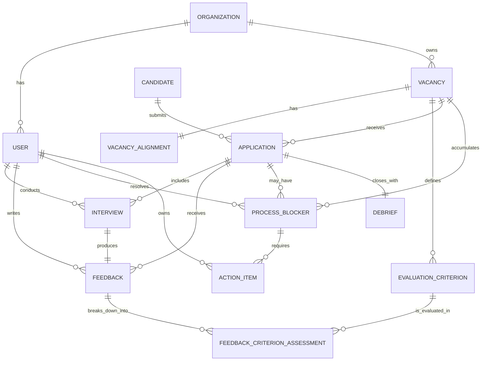

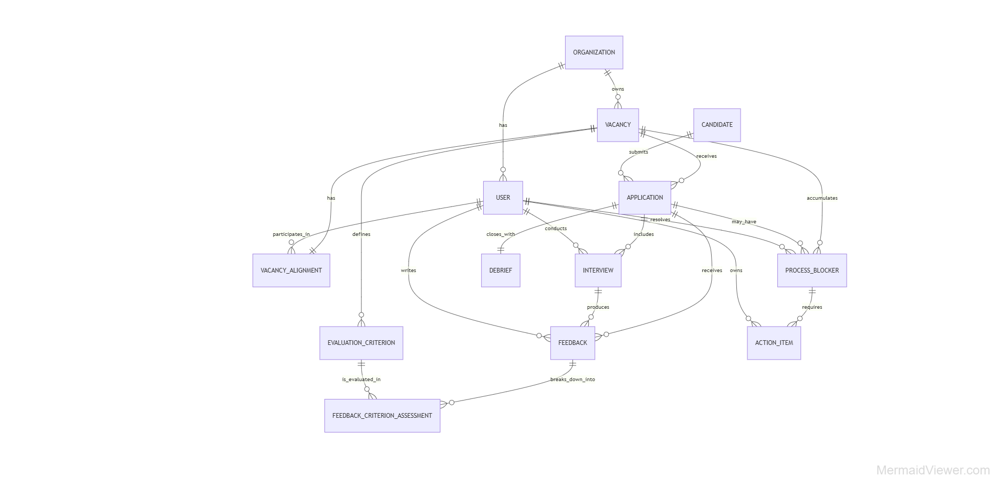

---

# 8. Diseño del sistema a alto nivel

## 8.1 Visión general

LTI se plantea como un **modular monolith orientado a dominio**, con módulos internos separados por responsabilidad funcional y una única fuente de verdad transaccional para el proceso de selección. Este enfoque permite evolucionar rápidamente en la fase MVP, mantener consistencia fuerte sobre el estado de vacantes y candidaturas, y evitar la complejidad operativa de una arquitectura distribuida prematura.

La arquitectura se organiza en cuatro niveles:

* Actores del sistema
* Aplicación Web LTI
* Módulos de dominio
* Servicios de apoyo

**Nota de alcance**
La autenticación y autorización se consideran capacidades transversales de plataforma y quedan fuera del alcance funcional detallado de este documento.

---

## 8.2 Componentes principales del sistema

### Aplicación Web LTI

**Responsabilidad**
Canaliza la interacción de recruiters, hiring managers e entrevistadores con el sistema.

**Casos de uso que soporta**

* Alineación de vacante
* Gestión de bloqueos
* Debrief y decisión final

**Entidades que utiliza**

* `Vacancy`
* `Application`
* `ProcessBlocker`
* `ActionItem`
* `Debrief`

**Interacciones**

* Consume Gestión de Vacantes y Alineación
* Consume Orquestación del Proceso
* Consume Evaluación y Feedback
* Consume Gestión de Debrief y Decisión

---

### Gestión de Vacantes y Alineación

**Responsabilidad**
Gestiona la definición de vacantes, el acuerdo inicial recruiter–manager y los criterios de evaluación.

**Casos de uso que soporta**

* Alineación de vacante

**Entidades que gestiona**

* `Vacancy`
* `VacancyAlignment`
* `EvaluationCriterion`
* `User`

**Interacciones**

* Expone vacantes alineadas a Orquestación del Proceso
* Proporciona criterios a Evaluación y Feedback

---

### Orquestación del Proceso

**Responsabilidad**
Gobierna el estado operativo de vacantes y candidaturas, detecta bloqueos, asigna responsabilidad y coordina acciones correctivas.

**Casos de uso que soporta**

* Gestión de bloqueos
* Soporte operativo al cierre de decisión final

**Entidades que gestiona**

* `Application`
* `ProcessBlocker`
* `ActionItem`
* `Vacancy`

**Interacciones**

* Consume Gestión de Vacantes y Alineación
* Consume Evaluación y Feedback
* Se coordina con Gestión de Debrief y Decisión
* Expone estado y bloqueos a Aplicación Web LTI

**Aclaración**
El **Centro de decisiones y bloqueos** es una capacidad funcional visible para el usuario.
**Orquestación del Proceso** es el componente interno que la soporta.

---

### Evaluación y Feedback

**Responsabilidad**
Gestiona entrevistas, feedback estructurado y valoraciones por criterio.

**Casos de uso que soporta**

* Gestión de bloqueos
* Debrief y decisión final

**Entidades que gestiona**

* `Interview`
* `Feedback`
* `FeedbackCriterionAssessment`
* `EvaluationCriterion`
* `Application`

**Interacciones**

* Recibe criterios desde Gestión de Vacantes y Alineación
* Informa a Orquestación del Proceso
* Proporciona insumos a Gestión de Debrief y Decisión
* Puede invocar Inteligencia Asistiva para revisión de calidad

---

### Gestión de Debrief y Decisión

**Responsabilidad**
Consolida la evaluación de una candidatura, genera el debrief final, registra la decisión y garantiza su trazabilidad.

**Casos de uso que soporta**

* Debrief y decisión final

**Entidades que gestiona**

* `Debrief`
* `Application`
* `Feedback`

**Interacciones**

* Consume insumos desde Evaluación y Feedback
* Consulta a Orquestación del Proceso si la candidatura está lista para cierre
* Consume Inteligencia Asistiva
* Expone el debrief final a Aplicación Web LTI

---

### Inteligencia Asistiva

**Responsabilidad**
Aporta capacidades de apoyo no determinista para síntesis, detección de inconsistencias y soporte al debrief.

**Casos de uso que soporta**

* Debrief y decisión final
* Revisión de calidad del feedback

**Entidades que utiliza**

* `Feedback`
* `FeedbackCriterionAssessment`
* `Debrief`

**Interacciones**

* Es consumida por Gestión de Debrief y Decisión
* Puede ser invocada por Evaluación y Feedback
* No persiste decisiones finales
* No modifica el estado operativo del proceso

---

### Persistencia transaccional del dominio

**Responsabilidad**
Proporciona almacenamiento consistente al modelo del dominio del MVP.

**Casos de uso que soporta**

* Soporte transversal a todo el sistema

**Entidades que almacena**

* `Organization`
* `User`
* `Vacancy`
* `VacancyAlignment`
* `EvaluationCriterion`
* `Candidate`
* `Application`
* `Interview`
* `Feedback`
* `FeedbackCriterionAssessment`
* `ProcessBlocker`
* `ActionItem`
* `Debrief`

**Interacciones**

* Es utilizada por todos los módulos de dominio
* No contiene lógica de negocio

---

## 8.3 Flujos de interacción de alto nivel

### Alineación de vacante

1. Aplicación Web LTI canaliza la creación de la vacante.
2. Gestión de Vacantes y Alineación registra la vacante y coordina la definición inicial.
3. El mismo módulo consolida el acuerdo recruiter–manager y define los criterios de evaluación.
4. Aplicación Web LTI presenta pendientes y validaciones a cada actor.
5. Cuando la alineación queda validada, la vacante se expone a Orquestación del Proceso.

### Gestión de bloqueos

1. Orquestación del Proceso monitoriza el estado operativo de vacantes y candidaturas.
2. Cuando detecta una condición que impide avanzar, registra un bloqueo y las acciones asociadas.
3. Aplicación Web LTI muestra el bloqueo, su responsable y las acciones pendientes.
4. Si el bloqueo depende de entrevistas o feedback, Orquestación del Proceso consulta a Evaluación y Feedback.
5. Los actores ejecutan las acciones correctivas a través de Aplicación Web LTI.
6. Orquestación del Proceso reevalúa el estado y decide si el proceso puede continuar.

### Debrief y decisión final

1. Evaluación y Feedback consolida las evaluaciones individuales de la candidatura.
2. Orquestación del Proceso verifica que no existen bloqueos que impidan el cierre.
3. Gestión de Debrief y Decisión solicita a Inteligencia Asistiva una síntesis del feedback.
4. Inteligencia Asistiva devuelve una propuesta de síntesis y señales de inconsistencia.
5. Gestión de Debrief y Decisión construye el debrief final y lo expone a Aplicación Web LTI.
6. Recruiter y hiring manager revisan el debrief y registran la decisión final.
7. Gestión de Debrief y Decisión persiste el cierre auditable y Orquestación del Proceso actualiza el estado global.

---

## 8.4 Decisiones de diseño

### Por qué se han separado los componentes

La separación sigue cambios reales de responsabilidad en el dominio:

* definir una vacante y alinearla
* gobernar la ejecución del proceso
* evaluar candidatos de forma estructurada
* consolidar la decisión final
* asistir con IA sin invadir la lógica transaccional

### Dónde reside la lógica de negocio principal

La lógica principal reside en:

* Gestión de Vacantes y Alineación
* Orquestación del Proceso
* Gestión de Debrief y Decisión

### Cómo se gestiona la consistencia del proceso

La fuente de verdad del sistema reside en el dominio persistido:

* inicio con `Vacancy` y `VacancyAlignment`
* ejecución con `Application`, `ProcessBlocker` y `ActionItem`
* cierre con `Debrief`

La IA nunca actúa como fuente de verdad ni altera por sí misma el estado del proceso.

### Cómo se integra la lógica de IA

La IA se encapsula en **Inteligencia Asistiva**:

* recibe contexto ya estructurado
* devuelve síntesis o señales
* no decide
* no persiste cierres
* no controla el flujo del proceso

### Trade-offs asumidos

* Se prioriza simplicidad evolutiva frente a escalabilidad distribuida
* Se acepta una única unidad de despliegue en el MVP
* Se separa lógicamente la IA para evitar acoplarla al núcleo del negocio
* Se favorece claridad funcional frente a optimización prematura

---

## 8.5 Diagrama de arquitectura de alto nivel

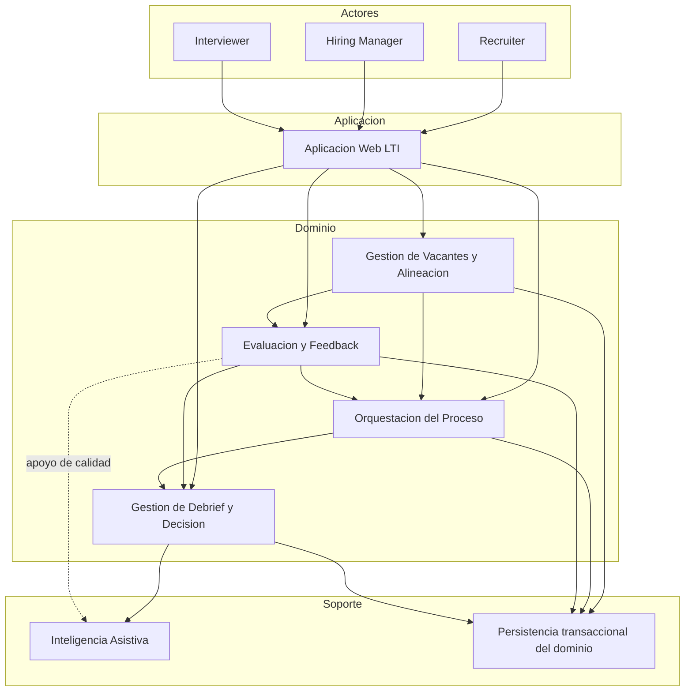

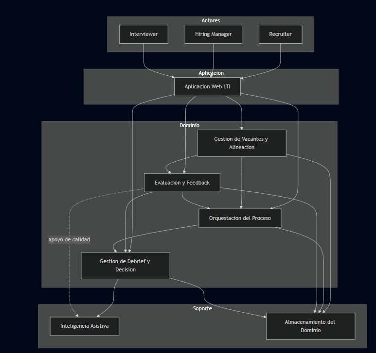

---

# 9. Vista C4 del sistema LTI (MVP)

## 9.1 Justificación de la elección del componente

Se elige **Orquestación del Proceso** porque es el núcleo del valor diferencial del MVP.
Este componente gobierna el estado operativo de vacantes y candidaturas, detecta bloqueos, coordina acciones correctivas y asegura que el proceso solo avanza cuando se cumplen las condiciones necesarias.

---

## 9.2 Nivel C1 — Contexto del sistema

LTI es una plataforma SaaS de recruiting utilizada por recruiters, hiring managers e interviewers para coordinar procesos de selección, estructurar la evaluación y cerrar decisiones con trazabilidad.

### Actores principales

* **Recruiter**: crea vacantes, coordina el proceso, gestiona bloqueos y registra cierres
* **Hiring Manager**: participa en la alineación de vacantes, desbloquea tareas y toma decisiones finales
* **Interviewer**: realiza entrevistas y emite feedback estructurado

### Diagrama C1 — Contexto

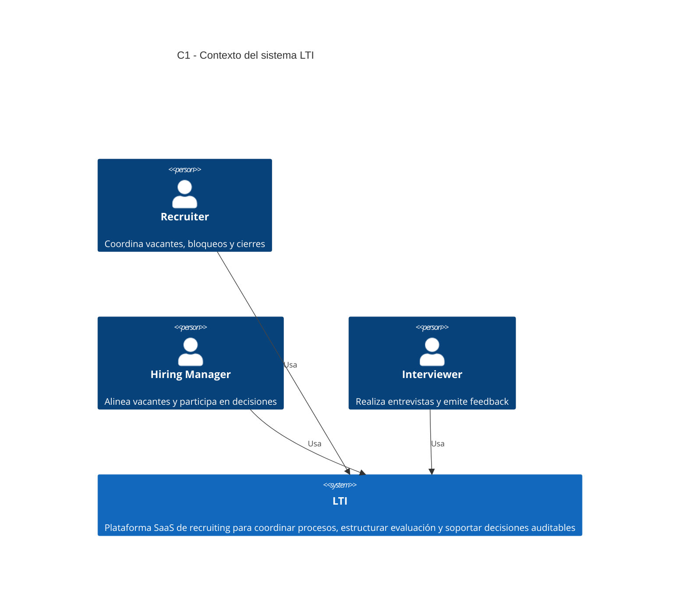

---

## 9.3 Nivel C2 — Contenedores

### Aplicación Web LTI

* **Responsabilidad**: interfaz principal del sistema
* **Interacción principal**: canaliza acciones de usuario y presenta estado, bloqueos, evaluaciones y debriefs

### Núcleo de Dominio LTI

* **Responsabilidad**: contiene la lógica funcional del MVP
* **Interacción principal**: recibe acciones desde la aplicación web, consulta persistencia y consume asistencia IA

### Inteligencia Asistiva

* **Responsabilidad**: apoya la síntesis de feedback y la detección de inconsistencias
* **Interacción principal**: es invocada por el núcleo de dominio

### Persistencia transaccional del dominio

* **Responsabilidad**: persistencia del modelo de dominio del MVP
* **Interacción principal**: es utilizada por el núcleo de dominio como fuente de verdad

### Diagrama C2 — Contenedores

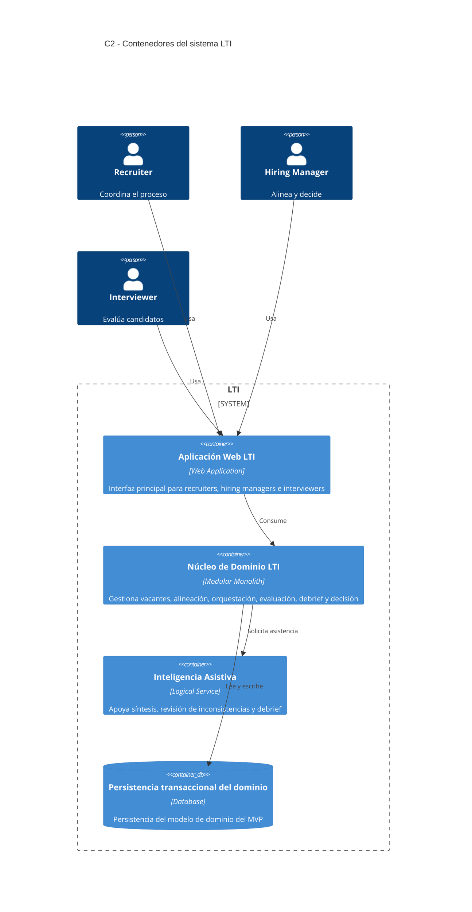

---

## 9.4 Nivel C3 — Componentes de Orquestación del Proceso

### Registro de Estado Operativo

* **Responsabilidad**: mantiene el estado operativo de vacantes y candidaturas
* **Entidades principales**: `Vacancy`, `Application`
* **Colaboración**: trabaja con Detector de Bloqueos, Coordinador de Cierre y Persistencia transaccional

### Detector de Bloqueos

* **Responsabilidad**: identifica condiciones que impiden avanzar y formaliza bloqueos operativos
* **Entidades principales**: `ProcessBlocker`, `Vacancy`, `Application`
* **Colaboración**: usa Registro de Estado Operativo, consulta Evaluación y Feedback y activa Gestor de Acciones Correctivas

### Gestor de Acciones Correctivas

* **Responsabilidad**: crea, asigna y sigue acciones necesarias para resolver bloqueos
* **Entidades principales**: `ActionItem`, `ProcessBlocker`, `User`
* **Colaboración**: recibe bloqueos del Detector de Bloqueos y expone tareas al Publicador de Pendientes

### Coordinador de Cierre

* **Responsabilidad**: valida si una candidatura está operativamente preparada para pasar a debrief y decisión
* **Entidades principales**: `Application`, `ProcessBlocker`
* **Colaboración**: consume estado operativo, consulta Evaluación y Feedback y habilita a Gestión de Debrief y Decisión

### Publicador de Pendientes

* **Responsabilidad**: expone a la aplicación web bloqueos, responsables y acciones pendientes
* **Entidades principales**: `ProcessBlocker`, `ActionItem`, `Application`
* **Colaboración**: usa información del Gestor de Acciones Correctivas y del Registro de Estado Operativo

### Diagrama C3 — Componentes de Orquestación del Proceso

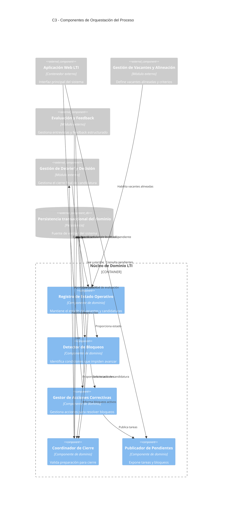

---

## 9.5 Nivel C4 — Descomposición interna del Detector de Bloqueos

El subcomponente elegido es **Detector de Bloqueos**, por ser la pieza más representativa de la lógica diferencial de Orquestación del Proceso.

### Catálogo de Reglas de Bloqueo

* **Responsabilidad**: define las condiciones de negocio que constituyen un bloqueo operativo
* **Relación**: es consultado por el Evaluador de Condiciones

### Evaluador de Condiciones

* **Responsabilidad**: analiza el estado operativo y determina si se cumple alguna regla de bloqueo
* **Relación**: consulta el Catálogo de Reglas, consume el Estado Operativo de Proceso y produce resultados para el Registro de Bloqueos

### Estado Operativo de Proceso

* **Responsabilidad**: representa la vista consolidada del estado actual de una vacante o candidatura para su evaluación operativa
* **Relación**: es usado por el Evaluador de Condiciones

### Registro de Bloqueos

* **Responsabilidad**: crea, actualiza o cierra representaciones persistentes de bloqueos detectados
* **Relación**: recibe decisiones del Evaluador, persiste bloqueos y notifica al Publicador de Eventos

### Repositorio de Bloqueos

* **Responsabilidad**: abstrae el acceso persistente a `ProcessBlocker`
* **Relación**: es usado por el Registro de Bloqueos

### Publicador de Eventos

* **Responsabilidad**: comunica la aparición, actualización o resolución de bloqueos al resto del módulo de orquestación
* **Relación**: recibe cambios desde Registro de Bloqueos y colabora con el Gestor de Acciones Correctivas y el Publicador de Pendientes

### Diagrama C4 — Descomposición lógica interna

> Mermaid no soporta un nivel C4 “Code” nativo. Por ello, el nivel 4 se representa como una descomposición lógica interna del subcomponente.

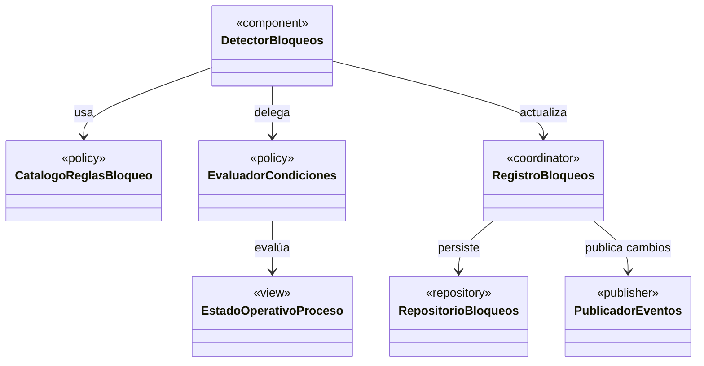

---

## 9.6 Nota final sobre la notación

Esta vista incluye:

* **C1** — Contexto
* **C2** — Contenedores
* **C3** — Componentes
* **C4** — Descomposición lógica interna del subcomponente más relevante

Los niveles C1, C2 y C3 se modelan con notación **C4 en Mermaid**, compatible con `mermaid.live`.
El nivel C4 se representa como una aproximación arquitectónica lógica mediante `classDiagram`, ya que Mermaid no dispone de un tipo nativo equivalente al nivel “Code” del modelo C4 clásico.
